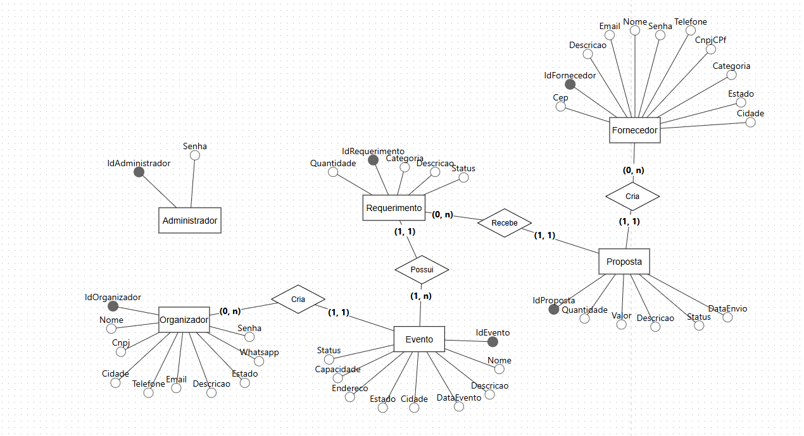

# Banco de Dados
 
## Diagrama

## Tabelas

### Administrador
- idAdministrador (PK)
- senha

### Organizador
- idOrganizador (PK)
- nome
- senha
- cnpj
- whatsapp
- cidade
- telefone
- email
- estado
- descricao

### Evento
- idEvento (PK)
- idOrganizador (FK)
- nome
- descricao
- capacidade
- endereco
- estado
- cidade
- dataEvento
- status

### Requerimento
- idRequerimento (PK)
- idEvento (FK)
- quantidade
- categoria
- descricao
- status

### Fornecedor
- idFornecedor (PK)
- nome
- email
- senha
- telefone
- cnpjCpf
- categoria
- estado
- cidade
- descricao
- cep

### Proposta
- idProposta (PK)
- idRequerimento (FK)
- idFornecedor (FK)
- quantidade
- valor
- descricao
- status
- dataEnvio

## Relacionamentos

- Organizador cria Evento (1:N)
- Evento possui Requerimento (1:N)
- Requerimento recebe Proposta (1:N)
- Fornecedor cria Proposta (1:N)

## SQL

[banco.sql](banco.sql)
